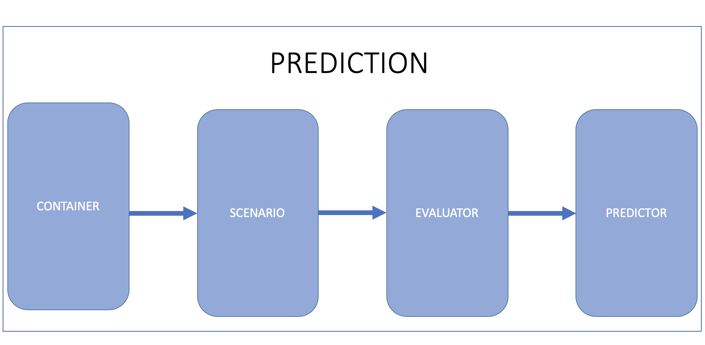
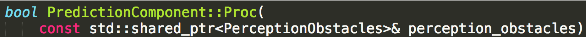
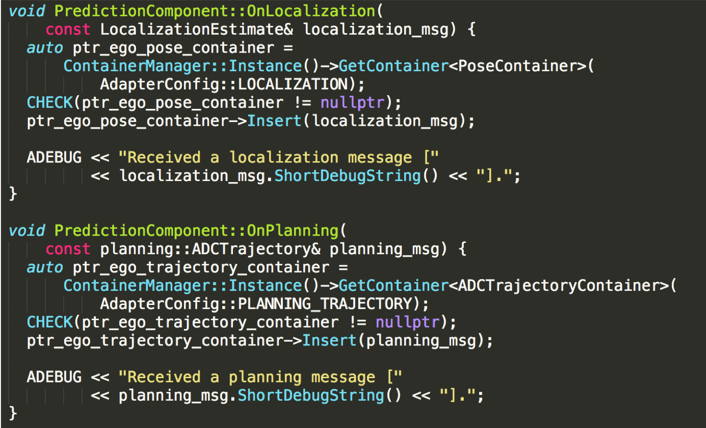

# Prediction

## Introduction
The Prediction module studies and predicts the behavior of all the obstacles detected by the perception module.
Prediction receives obstacle data along with basic perception information including positions, headings, velocities, accelerations, and then generates predicted trajectories with probabilities for those obstacles.

In **Apollo 5.5**, the Prediction module introduces a new model - **Caution Obstacle**. Together with aggressively emphasizing on caution when proceeding to a junction, this model will now scan all obstacles that have entered the junction as long as computing resources permit. The Semantic LSTM Evaluator and the Extrapolation Predictor have also been introduced in Apolo 5.5 to support the Caution Obstacle model.

```
Note:
The Prediction module only predicts the behavior of obstacles and not the EGO car. The Planning module plans the trajectory of the EGO car.

```

## Input
  * Obstacles information from the perception module
  * Localization information from the localization module
  * Planning trajectory of the previous computing cycle from the planning module

## Output
  * Obstacles annotated with predicted trajectories and their priorities. Obstacle priority is now calculated as individual scenarios are prioritized differently. The priorities include: ignore, caution and normal (default)

## Functionalities

Based on the figure below, the prediction module comprises 4 main functionalities: Container, Scenario, Evaluator and Predictor.  Container, Evaluator and Predictor existed in Apollo 3.0. In Apollo 3.5, we introduced the Scenario functionality as we have moved towards a more scenario-based approach for Apollo's autonomous driving capabilities.


### Container

Container stores input data from subscribed channels. Current supported
inputs are **_perception obstacles_**, **_vehicle localization_** and **_vehicle planning_**.

### Scenario

The Scenario sub-module analyzes scenarios that includes the ego vehicle.
Currently, we have two defined scenarios:
- **Cruise** : this scenario includes Lane keeping and following
- **Junction** : this scenario involves junctions. Junctions can either have traffic lights and/or STOP signs

### Obstacles

- **Ignore**: these obstacles will not affect the ego car's trajectory and can be safely ignored (E.g. the obstacle is too far away)
- **Caution**: these obstacles have a high possibility of interacting with the ego car
- **Normal**: the obstacles that do not fall under ignore or caution are placed by default under normal


### Evaluator

The Evaluator predicts path and speed separately for any given obstacle.
An evaluator evaluates a path by outputting a probability for it (lane
sequence) using the given model stored in _prediction/data/_.

The list of available evaluators include:

* **Cost evaluator**: probability is calculated by a set of cost functions

* **MLP evaluator**: probability is calculated using an MLP model

* **RNN evaluator**: probability is calculated using an RNN model

* **Cruise MLP + CNN-1d evaluator**: probability is calculated using a mix of MLP and CNN-1d models for the cruise scenario

* **Junction MLP evaluator**: probability is calculated using an MLP model for junction scenario

* **Junction Map evaluator**: probability is calculated using an semantic map-based CNN model for junction scenario. This evaluator was created for caution level obstacles

* **Social Interaction evaluator**: this model is used for pedestrians, for short term trajectory prediction. It uses social LSTM. This evaluator was created for caution level obstacles

* **Semantic LSTM evaluator**: this evaluator is used in the new Caution Obstacle model to generate short term trajectory points which are calculated using CNN and LSTM. Both vehicles and pedestrians are using this same model, but with different parameters

* **HiVT scene evaluator**: caution vehicles configured for this evaluator are
  predicted together in one TensorRT inference per frame. The scene includes
  up to 64 actors including ego; when caution targets exceed 63, the closest
  targets are prioritized, and remaining actor capacity is filled with context
  actors nearest to the selected targets. It uses up to 12 nearby complete lane
  polylines and omits lanes that would exceed 1024 lane-vector segments. Targets
  excluded by these limits, or by a scene inference failure, do not run a
  per-obstacle evaluator. The predictor stage still runs: the configured
  caution extrapolation predictor declines when no short-term trajectories are
  available, and Prediction then uses its configured normal predictor. The
  default engine path is `/apollo/modules/prediction/data/hivt64.engine`.
  TensorRT engines are tied to their build/runtime environment and should be
  rebuilt for the deployment TensorRT/GPU combination.
  `tools/validate_hivt_av1_sample.py` runs a limited Argoverse 1 forecasting
  sample smoke against the deployed engine and checkpoint in the test container;
  it uses approximate XML centerline lane selection and does not establish
  official validation metrics or Apollo HDMap feature parity.

* **Interactive predictor**: generates bounded lane and longitudinal motion
  candidates, aligns them to the timestamped ADC plan, and ranks them using
  trajectory clearance and same-lane TTC costs. Invalid or unavailable ADC
  plans use the configured kinematic predictor instead of a neural per-obstacle
  evaluator.

### Predictor

Predictor generates predicted trajectories for obstacles. Currently, the supported predictors include:

* **Empty**: obstacles have no predicted trajectories
* **Single lane**: Obstacles move along a single lane in highway navigation mode. Obstacles not on lane will be ignored.
* **Lane sequence**: obstacle moves along the lanes
* **Move sequence**: obstacle moves along the lanes by following its kinetic pattern
* **Free movement**: obstacle moves freely
* **Regional movement**: obstacle moves in a possible region
* **Junction**: Obstacles move toward junction exits with high probabilities
* **Interaction predictor**: creates ADC-conditioned candidate trajectories
  and normalizes their relative interaction scores into trajectory weights.
* **Extrapolation predictor**: extends the Semantic LSTM evaluator's results to create an 8 sec trajectory.

For targeted replay profiling, set `--prediction_enable_profiling=true` in the
Prediction component flag file. This emits INFO-level per-frame timing lines
for pose/planning updates, container preparation, evaluator and predictor
managers, HiVT scene selection/feature building, device selection, input
validation/shape setup, pre-transfer CPU time and context switches, host input
packing, profiling-probe overhead, H2D API-submit wall/CPU time and thread
context switches around transfer submission and TensorRT enqueue, tensor
binding, enqueue wall/CPU time, CUDA-event inference time, completion wait,
decode, publishing, and total callback processing. The flag is disabled by
default.

## HiVT baseline and validation

### Code layout

| Responsibility | Implementation | Focused tests / evidence |
| --- | --- | --- |
| Build bounded actor/map tensors | `evaluator/vehicle/hivt_scene_feature_builder.h` and `.cc` | `hivt_scene_feature_builder_test.cc` |
| Load the TensorRT engine, pack inputs, transfer, and enqueue | `evaluator/vehicle/hivt_tensorrt_executor.h`, `_gpu.cc`, and `_cpu.cc` | `hivt_tensorrt_executor_test.cc` |
| Decode actor-local six-mode outputs to Apollo coordinates | `evaluator/vehicle/hivt_scene_evaluator.h` and `.cc` | `hivt_scene_evaluator_test.cc` |
| Select eligible caution-vehicle targets once per frame | `evaluator/evaluator_manager.h` and `.cc` | `evaluator_manager_test.cc` |
| Compare deployed TensorRT output to checkpoint on AV1 samples | `tools/validate_hivt_av1_sample.py` | Offline smoke only; approximate XML-centerline lane selection |
| Record callback and transfer timings | `common/message_process.cc`, scene evaluator, and GPU executor | `--prediction_enable_profiling=true`; disabled by default |

When at least one target is admitted, the HiVT path performs one bounded scene
inference for the frame, not one model call per target. The engine admits up to
64 actors including ego and 1024 lane-vector segments; at most 63 caution
targets can be selected. See the
[HiVT migration and validation record](../../wheelos-service/context/modules/prediction/knowledge/hivt-migration-and-scene-quality-analysis.md)
for admission policy, replay contracts, and detailed evidence.

### Current measured baseline

| Validation tier | Data and result | What it establishes / does not establish |
| --- | --- | --- |
| Engine/checkpoint smoke | Five AV1 forecasting sample scenes; deployed TensorRT vs HiVT checkpoint max absolute error: trajectories `2.29e-5`, logits `3.82e-6`. Mean top-1 ADE/FDE `1.93/4.65 m`; best-of-six-by-ADE `1.15/2.40 m`. | TensorRT parity and smoke-level trajectory behavior on these five scenes. Approximate XML-centerline lane selection and a 12-lane cap mean this is not an official AV1 benchmark or Apollo feature-parity result. |
| Apollo message replay | Matching `demo_3.5.record` / `sunnyvale_big_loop`, isolated keep-lane fixture, half-rate replay: 455/455 source timestamps matched; 52 HiVT targets had six finite, ordered modes with normalized probabilities. For 23 targets with complete 3-second labels, top-1 ADE/FDE `2.673/3.888 m`, best-of-six `1.101/1.522 m`. | Verifies selected Prediction output contracts on this record/fixture, not full-rate delivery, Planning consumption, or general model quality. Pair outputs by copied `Header.lidar_timestamp`. |
| Callback/H2D profiling | Four matching-map replay rounds: 1,820 perception callbacks and 289 HiVT profiles. Each round had one first-after-idle H2D API outlier (`108.3–111.4 ms`); ordinary H2D p50 was about `0.015 ms`, p95 `0.018–0.023 ms`. | Exposes idle-associated transfer-submit latency, not sustained inference throughput. End-to-end production-rate performance remains unmeasured. |
| Isolated CUDA idle control | Same pinned buffer and thread: warm H2D `0.017 ms`; after 120 seconds without CUDA calls, first H2D `109.539 ms` wall / `108.851 ms` thread CPU. | Reproduces the delay outside Apollo and TensorRT. The exact NVIDIA driver, power-state, or PCIe transition remains unidentified. |

Run the AV1 smoke in the managed test container with the existing venv,
checkpoint, engine, and sample data:

```bash
PYTHONPATH=/usr/lib/python3.10/dist-packages \
  /apollo/.cache/hivt-inference/venv/bin/python \
  /apollo/modules/prediction/tools/validate_hivt_av1_sample.py
```

This is the reproducible offline baseline command. The official Argoverse 1.1
`val/data` split is absent locally, so official minADE, minFDE, miss-rate, and
calibration baselines remain blocked. Do not present the five-scene sample or
the 23-track Apollo subset as benchmark results.

## Prediction Architecture

The prediction module estimates the future motion trajectories for all perceived obstacles. The output prediction message wraps the perception information. Prediction both subscribes to and is triggered by perception obstacle messages, as shown below:



The prediction module also takes messages from both localization and planning as input. The structure is shown below:



## Related Paper

1. [Xu K, Xiao X, Miao J, Luo Q. "Data Driven Prediction Architecture for Autonomous Driving and its Application on Apollo Platform." *arXiv preprint arXiv:2006.06715.* ](https://arxiv.org/pdf/2006.06715.pdf)
